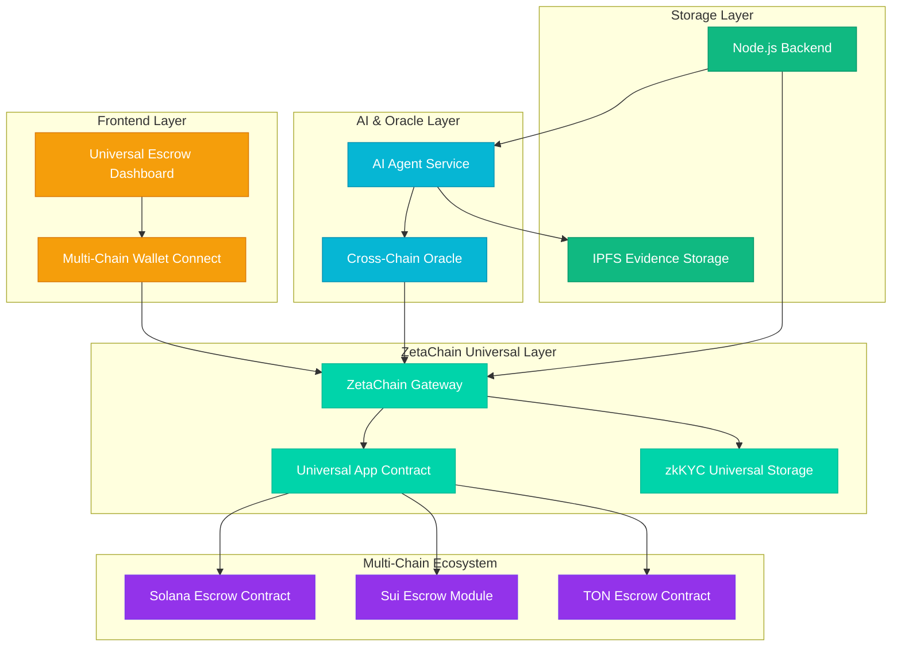
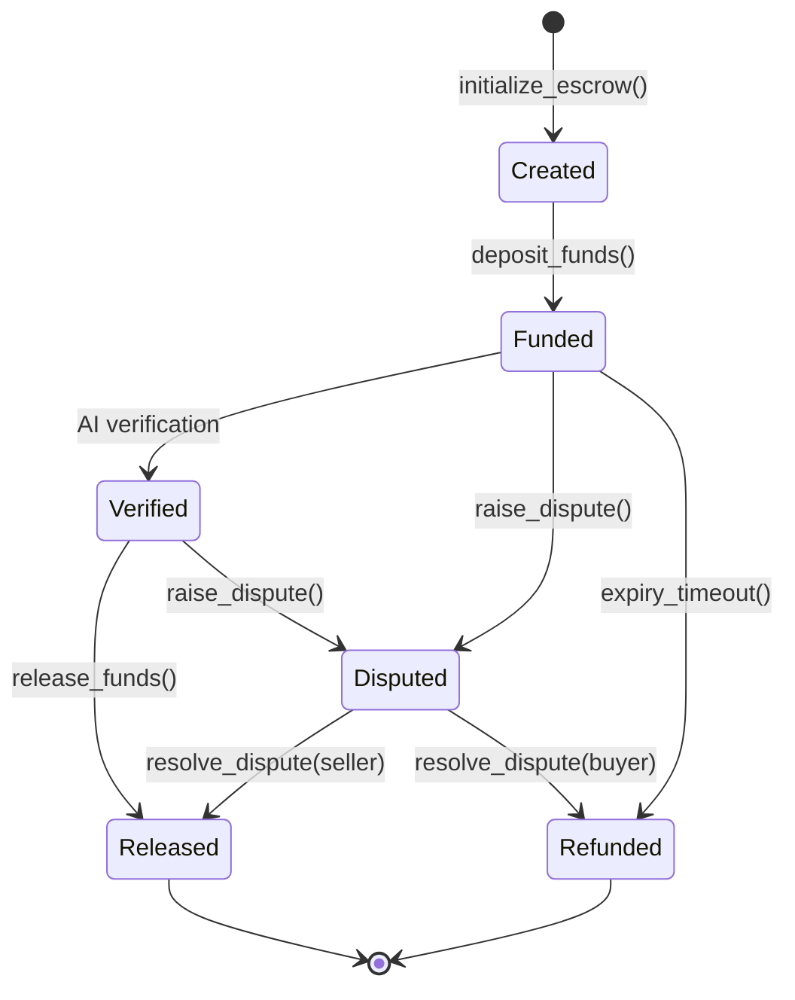

# AetherLock Protocol Design Document

## Overview

AetherLock is a multi-chain escrow protocol that combines Solana's fast transaction processing with Zeta Chain's zero-knowledge capabilities and AI-powered verification. The system creates a trustless environment where AI agents act as objective arbiters for task completion verification.

## Architecture



## Components and Interfaces

### 1. Solana Escrow Smart Contract

**Core Account Structure:**
```rust
#[account]
pub struct EscrowAccount {
    pub escrow_id: [u8; 32],
    pub buyer: Pubkey,
    pub seller: Pubkey,
    pub token_mint: Pubkey,
    pub amount: u64,
    pub fee_amount: u64, // 2% of amount
    pub status: EscrowStatus,
    pub expiry: i64,
    pub metadata_hash: [u8; 32],
    pub verification_result: Option<bool>,
    pub evidence_hash: Option<[u8; 32]>,
    pub dispute_raised: bool,
    pub dispute_deadline: Option<i64>,
    pub ai_agent_pubkey: Pubkey,
    pub bump: u8,
}

#[derive(AnchorSerialize, AnchorDeserialize, Clone, PartialEq, Eq)]
pub enum EscrowStatus {
    Created,
    Funded,
    Verified,
    Disputed,
    Released,
    Refunded,
}
```

**Key Functions:**
- `initialize_escrow()`: Creates escrow with participants and terms
- `deposit_funds()`: Transfers tokens to escrow PDA
- `submit_verification()`: Accepts AI agent signed verification
- `release_funds()`: Transfers to seller minus 2% fee
- `refund_buyer()`: Returns funds to buyer
- `raise_dispute()`: Initiates dispute process
- `resolve_dispute()`: Admin resolution function

### 2. AI Agent Architecture

**Verification Flow:**
1. **Task Analysis**: AI agent receives task description and evidence
2. **Evidence Processing**: Analyzes uploaded files, screenshots, or data
3. **Deterministic Scoring**: Generates boolean result based on completion criteria
4. **Signature Generation**: Signs verification payload with Ed25519 key
5. **Oracle Submission**: Submits signed result to verification oracle

**Agent Payload Structure:**
```typescript
interface VerificationPayload {
  escrow_id: string;
  result: boolean;
  evidence_hash: string;
  confidence_score: number;
  timestamp: number;
  agent_version: string;
}
```

### 3. zkMe Integration (Zeta Chain)

**KYC Flow:**
1. User initiates KYC through frontend
2. zkMe SDK redirects to verification interface
3. User completes identity verification off-chain
4. zkMe generates zero-knowledge proof
5. Proof hash stored on Zeta Chain testnet
6. AetherLock references proof for escrow eligibility

**Integration Points:**
- Frontend: zkMe SDK integration for user flow
- Backend: Proof validation and hash storage
- Smart Contract: KYC status verification before escrow creation

### 4. Frontend Dashboard Design - Motion & Visual Excellence

**Cyberpunk Aesthetic with Advanced Animations:**
- **Color Palette**: Deep black (#000000) base with electric purple (#9333ea), cyan (#06b6d4), and neon green (#10b981) accents
- **Typography**: Futuristic fonts (Orbitron, Exo 2) with glowing text effects
- **Particle Systems**: Three.js background with floating particles and connection lines
- **Holographic Effects**: CSS shaders for holographic card surfaces and UI elements

**Advanced Motion Design System:**
- **Page Transitions**: Smooth morphing transitions using Framer Motion with spring physics
- **Micro-interactions**: Hover effects with neon glow, scale transforms, and particle bursts
- **Loading States**: Animated progress bars with pulsing energy effects and percentage counters
- **Real-time Animations**: Live data visualization with animated charts and flowing connection lines
- **Gesture Support**: Touch gestures for mobile with haptic feedback simulation

**Interactive Components:**
- **3D Escrow Cards**: Rotating cards with depth, shadows, and interactive hover states
- **Animated Status Indicators**: Pulsing orbs, flowing progress rings, and morphing icons
- **Floating Action Buttons**: Magnetic hover effects with expanding ripple animations
- **Dynamic Backgrounds**: Responsive particle fields that react to user interactions
- **Glitch Effects**: Subtle digital glitch animations on state changes

**Page Structure with Motion:**
```
/                 - Hero with animated 3D logo, particle background, floating CTA buttons
/dashboard        - Grid layout with staggered card animations, live data streams
/escrow/[id]      - Timeline visualization with animated progress, interactive evidence viewer
/kyc              - Step-by-step wizard with morphing progress indicators
/settings         - Accordion panels with smooth expand/collapse, toggle animations
```

**Performance Optimizations:**
- **GPU Acceleration**: Hardware-accelerated CSS transforms and WebGL effects
- **Lazy Loading**: Progressive loading of heavy animations based on viewport
- **Reduced Motion**: Respect user preferences with fallback static designs
- **60fps Target**: Optimized animations maintaining smooth 60fps performance

## Data Models

### Escrow Lifecycle State Machine



### Database Schema (Backend)

```typescript
interface EscrowMetadata {
  id: string;
  title: string;
  description: string;
  task_requirements: string[];
  created_at: Date;
  updated_at: Date;
  kyc_verified: boolean;
  evidence_urls: string[];
}

interface VerificationLog {
  escrow_id: string;
  agent_id: string;
  result: boolean;
  confidence: number;
  evidence_hash: string;
  signature: string;
  timestamp: Date;
}
```

## Error Handling

### Smart Contract Error Codes
- `InvalidEscrowState`: Operation not allowed in current state
- `InsufficientFunds`: Buyer wallet lacks required tokens
- `ExpiredEscrow`: Operation attempted after expiry
- `UnauthorizedSigner`: Invalid AI agent signature
- `DisputeActive`: Operation blocked due to active dispute

### Frontend Error Handling
- **Wallet Connection**: Graceful fallback for unsupported wallets
- **Transaction Failures**: Retry mechanism with exponential backoff
- **Network Issues**: Offline mode with cached data
- **AI Verification**: Timeout handling with manual override option

### AI Agent Error Recovery
- **Evidence Processing Failure**: Request evidence re-upload
- **Signature Generation Error**: Agent key rotation mechanism
- **Oracle Communication**: Retry with different oracle endpoints

## Testing Strategy

### Unit Tests
- **Smart Contract**: Anchor test framework for all escrow functions
- **AI Agent**: Jest tests for verification logic and signature generation
- **Frontend**: React Testing Library for component behavior

### Integration Tests
- **End-to-End Flow**: Playwright tests for complete user journey
- **Cross-Chain**: zkMe KYC integration with Zeta Chain testnet
- **AI Verification**: Mock AI responses for deterministic testing

### Security Tests
- **Smart Contract**: Fuzzing tests for edge cases and overflow protection
- **Signature Verification**: Test invalid signatures and replay attacks
- **Access Control**: Verify proper authorization for all functions

### Performance Tests
- **Transaction Throughput**: Solana devnet stress testing
- **AI Response Time**: Verification latency under load
- **Frontend Responsiveness**: Mobile performance optimization

## Security Considerations

### Smart Contract Security
- **Reentrancy Protection**: Use Anchor's built-in protections
- **Integer Overflow**: SafeMath equivalent checks
- **Access Control**: Proper signer verification for all functions
- **PDA Security**: Secure program-derived address generation

### AI Agent Security
- **Key Management**: Secure storage of Ed25519 private keys
- **Signature Verification**: Prevent signature replay attacks
- **Evidence Validation**: Sanitize uploaded evidence files
- **Rate Limiting**: Prevent spam verification requests

### Privacy Protection
- **On-Chain Data**: Only store hashes, never raw PII
- **IPFS Storage**: Encrypt sensitive evidence before upload
- **zkKYC**: Leverage zero-knowledge proofs for privacy-preserving verification
- **Audit Trail**: Maintain verification logs without exposing user data

## ZetaChain Universal Integration

### Universal App Architecture

**ZetaChain Gateway Integration:**
```typescript
interface UniversalEscrowContract {
  onCall(context: CallContext, message: bytes): Promise<void>;
  onRevert(context: RevertContext): Promise<void>;
  onAbort(): Promise<void>;
}
```

**Cross-Chain Message Flow:**
1. **Escrow Creation**: Solana → ZetaChain Gateway → Broadcast to Sui/TON
2. **AI Verification**: Any Chain → ZetaChain Gateway → Update Universal State
3. **Fund Release**: ZetaChain Gateway → Execute on Origin Chain
4. **Dispute Resolution**: Cross-chain consensus via ZetaChain arbitration

### Multi-Chain Escrow State Management

**Universal Escrow State:**
```rust
pub struct UniversalEscrowState {
    pub escrow_id: [u8; 32],
    pub origin_chain: ChainId,
    pub linked_chains: Vec<ChainId>,
    pub universal_status: EscrowStatus,
    pub zkkyc_proof_hash: [u8; 32],
    pub cross_chain_logs: Vec<CrossChainEvent>,
}

pub enum ChainId {
    Solana = 1,
    Sui = 2,
    TON = 3,
}
```

### Cross-Chain Event Logging

**Event Types:**
- `onCall`: Successful cross-chain message execution
- `onRevert`: Failed transaction with rollback
- `onAbort`: Emergency termination across all chains

**Log Structure:**
```typescript
interface CrossChainEvent {
  eventType: 'onCall' | 'onRevert' | 'onAbort';
  sourceChain: ChainId;
  targetChain: ChainId;
  escrowId: string;
  timestamp: number;
  transactionHash: string;
  gasUsed: bigint;
}
```

### Universal Dashboard Design

**Chain Connectivity Visualization:**
- Interactive network diagram showing Solana ↔ Sui ↔ TON connections
- Real-time status indicators for each chain
- Cross-chain transaction flow animation

**Universal Escrow Interface:**
- Origin chain badge (Solana/Sui/TON)
- Linked chains status panel
- zkKYC verification status across all chains
- Cross-chain activity timeline with ZetaChain Gateway events

**Neon-Dark Theme Elements:**
- Electric blue (#00d4aa) for ZetaChain elements
- Purple (#9333ea) for blockchain connections
- Cyan (#06b6d4) for AI verification status
- Animated connection lines between chains

## Deployment Architecture

### Development Environment
- **Solana**: Devnet for rapid iteration and testing
- **ZetaChain**: Testnet for Universal App deployment and zkMe integration
- **Sui**: Testnet for cross-chain escrow module
- **TON**: Testnet for smart contract integration
- **Frontend**: Vercel deployment with preview branches
- **Backend**: AWS Lambda for serverless AI agent execution

### Production Considerations
- **Multi-Region**: Deploy across multiple AWS regions for redundancy
- **Load Balancing**: Distribute AI agent requests across instances
- **Cross-Chain Monitoring**: ZetaChain Gateway event tracking and alerting
- **Universal State Backup**: Regular snapshots of cross-chain escrow state
- **Monitoring**: CloudWatch for system health and performance metrics