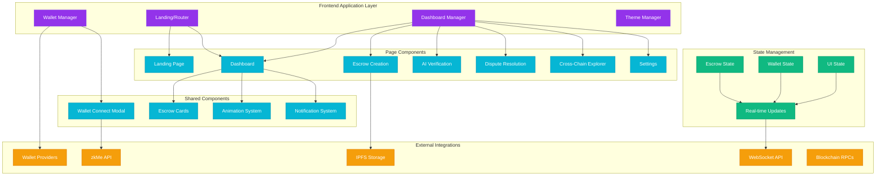

# Interactive Dashboard Frontend Design Document

## Overview

The Interactive Dashboard Frontend is a complete rewrite of AetherLock's user interface, transforming it into a modern, cyberpunk-themed Web3 application. The design emphasizes visual excellence, smooth animations, comprehensive wallet integration, and real-time data visualization across multiple blockchains.

## Architecture



## Components and Interfaces

### 1. Design System and Theme Architecture

**Neon-Dark Cyberpunk Theme:**
```typescript
interface ThemeConfig {
  colors: {
    primary: {
      background: '#000000',
      surface: '#0a0a0a',
      card: '#111111',
      border: '#1a1a1a'
    },
    accent: {
      electric: '#00d4aa',    // ZetaChain green
      purple: '#9333ea',      // Primary purple
      cyan: '#06b6d4',        // AI verification
      neon: '#10b981'         // Success states
    },
    status: {
      pending: '#f59e0b',
      verified: '#10b981',
      disputed: '#ef4444',
      failed: '#dc2626'
    }
  },
  typography: {
    fonts: {
      primary: 'Inter, system-ui, sans-serif',
      display: 'Orbitron, monospace',
      code: 'JetBrains Mono, monospace'
    },
    sizes: {
      xs: '0.75rem',
      sm: '0.875rem',
      base: '1rem',
      lg: '1.125rem',
      xl: '1.25rem',
      '2xl': '1.5rem',
      '3xl': '1.875rem',
      '4xl': '2.25rem'
    }
  },
  animations: {
    duration: {
      fast: '150ms',
      normal: '300ms',
      slow: '500ms'
    },
    easing: {
      ease: 'cubic-bezier(0.4, 0, 0.2, 1)',
      spring: 'cubic-bezier(0.68, -0.55, 0.265, 1.55)'
    }
  }
}
```

**Animation System Architecture:**
```typescript
interface AnimationSystem {
  pageTransitions: {
    enter: FramerMotionVariant;
    exit: FramerMotionVariant;
    initial: FramerMotionVariant;
  };
  cardAnimations: {
    hover: FramerMotionVariant;
    tap: FramerMotionVariant;
    loading: FramerMotionVariant;
  };
  particleSystem: {
    background: ParticleConfig;
    interactive: ParticleConfig;
    verification: ParticleConfig;
  };
}
```

### 2. Landing Page Component Architecture

**Hero Section Design:**
```typescript
interface HeroSection {
  title: {
    primary: "Trustless AI Escrow";
    secondary: "for Web3 Transactions";
    animation: "typewriter" | "fade-up" | "glitch";
  };
  background: {
    type: "particle-field";
    elements: ["floating-nodes", "connection-lines", "energy-pulses"];
    interactivity: boolean;
  };
  ctaButtons: {
    primary: {
      text: "Launch App";
      destination: "/dashboard";
      style: "neon-glow";
    };
    secondary: {
      text: "Documentation";
      destination: "external-mintlify";
      style: "outline-glow";
    };
  };
}
```

**Feature Showcase Sections:**
```typescript
interface FeatureShowcase {
  sections: [
    {
      title: "AI-Powered Verification";
      description: "Automated task completion validation";
      visual: "ai-brain-animation";
      color: "cyan";
    },
    {
      title: "zkKYC Integration";
      description: "Privacy-preserving identity verification";
      visual: "shield-lock-animation";
      color: "purple";
    },
    {
      title: "Cross-Chain Support";
      description: "Solana, Sui, TON via ZetaChain";
      visual: "network-map-animation";
      color: "electric";
    }
  ];
}
```

### 3. Wallet Connection Modal System

**Multi-Wallet Support Architecture:**
```typescript
interface WalletProvider {
  id: 'phantom' | 'solflare' | 'walletconnect' | 'tonkeeper' | 'slush';
  name: string;
  icon: string;
  chains: ChainId[];
  connect: () => Promise<WalletConnection>;
  disconnect: () => Promise<void>;
  signTransaction: (tx: Transaction) => Promise<SignedTransaction>;
}

interface WalletConnection {
  address: string;
  chainId: ChainId;
  balance: TokenBalance[];
  isConnected: boolean;
}

interface WalletModal {
  isOpen: boolean;
  providers: WalletProvider[];
  selectedProvider: WalletProvider | null;
  connectionState: 'idle' | 'connecting' | 'connected' | 'error';
  onConnect: (provider: WalletProvider) => Promise<void>;
  onClose: () => void;
}
```

**zkKYC Integration Flow:**
```typescript
interface ZkKYCFlow {
  status: 'not-started' | 'in-progress' | 'completed' | 'failed';
  zkMeConfig: {
    apiKey: string;
    environment: 'testnet' | 'mainnet';
    redirectUrl: string;
  };
  verificationSteps: [
    { id: 'identity', status: StepStatus, description: string },
    { id: 'proof-generation', status: StepStatus, description: string },
    { id: 'blockchain-storage', status: StepStatus, description: string }
  ];
  proofHash: string | null;
  onVerify: () => Promise<void>;
  onSkip: () => void;
}
```

### 4. Main Dashboard Interface Design

**Dashboard Layout System:**
```typescript
interface DashboardLayout {
  header: {
    logo: ReactComponent;
    walletInfo: WalletInfoComponent;
    networkSelector: NetworkSelectorComponent;
    themeToggle: ThemeToggleComponent;
  };
  sidebar: {
    balance: WalletBalanceComponent;
    kycStatus: KYCStatusComponent;
    quickActions: QuickActionComponent[];
    networkStatus: NetworkStatusComponent;
  };
  mainContent: {
    tabs: ['my-escrows', 'create-new', 'verification-logs', 'disputes'];
    activeTab: string;
    content: ReactComponent;
  };
  notifications: NotificationSystemComponent;
}
```

**Escrow Card Component:**
```typescript
interface EscrowCard {
  escrow: {
    id: string;
    buyer: string;
    seller: string;
    amount: TokenAmount;
    status: EscrowStatus;
    aiVerificationStatus: AIVerificationStatus;
    disputeTimer: number | null;
    createdAt: Date;
    expiresAt: Date;
  };
  animations: {
    hover: FramerMotionVariant;
    statusChange: FramerMotionVariant;
    loading: FramerMotionVariant;
  };
  actions: {
    view: () => void;
    dispute: () => void;
    cancel: () => void;
  };
}
```

**Real-Time Updates System:**
```typescript
interface RealTimeSystem {
  websocket: {
    url: string;
    reconnectAttempts: number;
    heartbeatInterval: number;
  };
  subscriptions: {
    escrowUpdates: (escrowId: string) => void;
    aiVerification: (escrowId: string) => void;
    blockchainEvents: (address: string) => void;
    disputeMessages: (escrowId: string) => void;
  };
  eventHandlers: {
    onEscrowStatusChange: (event: EscrowStatusEvent) => void;
    onVerificationComplete: (event: VerificationEvent) => void;
    onDisputeUpdate: (event: DisputeEvent) => void;
  };
}
```

### 5. Escrow Creation Form Design

**Form Architecture:**
```typescript
interface EscrowCreationForm {
  fields: {
    sellerAddress: {
      type: 'wallet-address';
      validation: AddressValidator;
      suggestions: RecentAddresses[];
    };
    amount: {
      type: 'token-amount';
      tokens: ['SOL', 'USDC', 'TON', 'SUI'];
      validation: AmountValidator;
      balanceCheck: boolean;
    };
    taskDescription: {
      type: 'rich-text';
      maxLength: 2000;
      templates: TaskTemplate[];
    };
    deadline: {
      type: 'datetime-picker';
      minDate: Date;
      maxDate: Date;
      timezone: string;
    };
    evidence: {
      type: 'file-upload';
      ipfs: IPFSConfig;
      allowedTypes: string[];
      maxSize: number;
    };
  };
  validation: FormValidation;
  submission: {
    steps: ['validate', 'upload-evidence', 'create-escrow', 'fund-escrow'];
    onSubmit: (data: EscrowCreationData) => Promise<void>;
  };
}
```

**IPFS Evidence Upload System:**
```typescript
interface IPFSUploadSystem {
  config: {
    gateway: string;
    apiKey: string;
    pinningService: 'pinata' | 'infura' | 'web3storage';
  };
  upload: {
    onProgress: (progress: number) => void;
    onComplete: (hash: string) => void;
    onError: (error: Error) => void;
  };
  preview: {
    supportedTypes: ['image', 'pdf', 'text', 'video'];
    generateThumbnail: (file: File) => Promise<string>;
  };
}
```

### 6. AI Verification Visualizer

**Verification Process Display:**
```typescript
interface AIVerificationVisualizer {
  stages: [
    {
      id: 'evidence-upload';
      title: 'Uploading Evidence';
      status: 'pending' | 'active' | 'complete' | 'error';
      animation: 'upload-progress';
    },
    {
      id: 'ai-processing';
      title: 'AI Processing';
      status: 'pending' | 'active' | 'complete' | 'error';
      animation: 'brain-thinking';
    },
    {
      id: 'signature-generation';
      title: 'Signature Submitted';
      status: 'pending' | 'active' | 'complete' | 'error';
      animation: 'signature-glow';
    },
    {
      id: 'verification-complete';
      title: 'Verified ✅';
      status: 'pending' | 'active' | 'complete' | 'error';
      animation: 'success-burst';
    }
  ];
  details: {
    evidenceHash: string;
    aiVerdict: boolean;
    confidenceScore: number;
    timestamp: Date;
    oracleTransactionHash: string;
    zetaChainExplorerLink: string;
  };
  animations: {
    progressBar: FramerMotionVariant;
    stageTransitions: FramerMotionVariant;
    particleEffects: ParticleConfig;
  };
}
```

### 7. Dispute Resolution Interface

**Timeline Visualization:**
```typescript
interface DisputeTimeline {
  events: [
    {
      type: 'creation';
      timestamp: Date;
      actor: 'buyer' | 'seller';
      description: string;
      icon: ReactComponent;
    },
    {
      type: 'verification';
      timestamp: Date;
      actor: 'ai-agent';
      description: string;
      icon: ReactComponent;
    },
    {
      type: 'dispute-raised';
      timestamp: Date;
      actor: 'buyer' | 'seller';
      description: string;
      icon: ReactComponent;
    },
    {
      type: 'resolution';
      timestamp: Date | null;
      actor: 'admin' | 'auto';
      description: string;
      icon: ReactComponent;
    }
  ];
  visualization: {
    layout: 'vertical' | 'horizontal';
    animations: TimelineAnimations;
    interactivity: boolean;
  };
}
```

**Chat Interface System:**
```typescript
interface DisputeChatSystem {
  participants: {
    buyer: UserProfile;
    seller: UserProfile;
    admin: AdminProfile;
  };
  messages: {
    id: string;
    sender: 'buyer' | 'seller' | 'admin' | 'system';
    content: string;
    timestamp: Date;
    attachments: Attachment[];
    type: 'text' | 'evidence' | 'system-notification';
  }[];
  actions: {
    sendMessage: (content: string) => Promise<void>;
    uploadEvidence: (file: File) => Promise<void>;
    requestAIRecheck: () => Promise<void>;
  };
  autoResolution: {
    countdown: number;
    deadline: Date;
    onExpiry: () => void;
  };
}
```

### 8. Cross-Chain Explorer Design

**Network Map Visualization:**
```typescript
interface CrossChainExplorer {
  networkMap: {
    nodes: [
      { id: 'solana', position: [x, y], status: 'active' | 'inactive' },
      { id: 'zetachain', position: [x, y], status: 'active' | 'inactive' },
      { id: 'sui', position: [x, y], status: 'active' | 'inactive' },
      { id: 'ton', position: [x, y], status: 'active' | 'inactive' }
    ];
    connections: [
      { from: 'solana', to: 'zetachain', status: 'active', latency: number },
      { from: 'zetachain', to: 'sui', status: 'active', latency: number },
      { from: 'zetachain', to: 'ton', status: 'active', latency: number }
    ];
    animations: {
      dataFlow: ParticleFlowConfig;
      nodeStatus: NodeAnimationConfig;
      connectionPulse: ConnectionAnimationConfig;
    };
  };
  transactionLogs: {
    events: CrossChainEvent[];
    filters: EventFilter[];
    realTimeUpdates: boolean;
  };
  explorerLinks: {
    solana: string;
    zetachain: string;
    sui: string;
    ton: string;
  };
}
```

### 9. Settings and Profile Management

**Settings Interface:**
```typescript
interface SettingsInterface {
  sections: {
    profile: {
      walletAddress: string;
      kycStatus: KYCStatus;
      connectedNetworks: NetworkInfo[];
      avatar: string | null;
    };
    preferences: {
      aiVerificationMode: 'manual' | 'automatic';
      theme: 'dark' | 'light' | 'system';
      language: 'en' | 'es' | 'zh';
      notifications: NotificationPreferences;
    };
    security: {
      twoFactorAuth: boolean;
      sessionTimeout: number;
      trustedDevices: Device[];
    };
    advanced: {
      rpcEndpoints: RPCEndpoint[];
      gasSettings: GasSettings;
      debugMode: boolean;
    };
  };
  actions: {
    updateProfile: (data: ProfileData) => Promise<void>;
    changeTheme: (theme: Theme) => void;
    exportData: () => Promise<void>;
    deleteAccount: () => Promise<void>;
  };
}
```

## Data Models

### Frontend State Management

**Global State Architecture:**
```typescript
interface GlobalState {
  wallet: {
    isConnected: boolean;
    address: string | null;
    balance: TokenBalance[];
    provider: WalletProvider | null;
    chainId: ChainId;
  };
  escrows: {
    list: Escrow[];
    loading: boolean;
    error: string | null;
    filters: EscrowFilters;
    pagination: Pagination;
  };
  ui: {
    theme: Theme;
    sidebarOpen: boolean;
    activeTab: string;
    notifications: Notification[];
    modals: ModalState;
  };
  realTime: {
    connected: boolean;
    subscriptions: string[];
    lastUpdate: Date;
  };
}
```

**Component State Patterns:**
```typescript
// React Query for server state
interface EscrowQueries {
  useEscrows: (filters: EscrowFilters) => UseQueryResult<Escrow[]>;
  useEscrow: (id: string) => UseQueryResult<Escrow>;
  useVerificationLogs: (escrowId: string) => UseQueryResult<VerificationLog[]>;
  useDisputeMessages: (escrowId: string) => UseQueryResult<DisputeMessage[]>;
}

// Zustand for client state
interface UIStore {
  theme: Theme;
  sidebarOpen: boolean;
  activeModal: string | null;
  setTheme: (theme: Theme) => void;
  toggleSidebar: () => void;
  openModal: (modal: string) => void;
  closeModal: () => void;
}
```

## Error Handling

### Frontend Error Boundaries

**Error Classification System:**
```typescript
interface ErrorHandler {
  categories: {
    wallet: WalletError[];
    network: NetworkError[];
    validation: ValidationError[];
    api: APIError[];
    ui: UIError[];
  };
  recovery: {
    retry: (operation: () => Promise<void>) => Promise<void>;
    fallback: (component: ReactComponent) => ReactComponent;
    notification: (error: Error) => void;
  };
  logging: {
    local: (error: Error) => void;
    remote: (error: Error) => Promise<void>;
  };
}
```

**User-Friendly Error Messages:**
```typescript
interface ErrorMessages {
  wallet: {
    'connection-failed': 'Unable to connect wallet. Please try again.';
    'insufficient-funds': 'Insufficient balance for this transaction.';
    'transaction-rejected': 'Transaction was rejected by your wallet.';
  };
  network: {
    'rpc-error': 'Network connection issue. Retrying...';
    'chain-mismatch': 'Please switch to the correct network.';
  };
  validation: {
    'invalid-address': 'Please enter a valid wallet address.';
    'amount-too-low': 'Amount must be greater than minimum.';
  };
}
```

## Testing Strategy

### Component Testing Architecture

**Testing Framework Setup:**
```typescript
interface TestingConfig {
  frameworks: {
    unit: 'vitest';
    integration: 'playwright';
    e2e: 'cypress';
  };
  mocking: {
    wallets: MockWalletProvider[];
    api: MSWHandlers[];
    blockchain: MockRPCProvider;
  };
  fixtures: {
    escrows: EscrowFixture[];
    users: UserFixture[];
    transactions: TransactionFixture[];
  };
}
```

**Test Coverage Requirements:**
```typescript
interface TestCoverage {
  components: {
    unit: 90; // 90% coverage for component logic
    integration: 80; // 80% coverage for component interactions
  };
  hooks: {
    unit: 95; // 95% coverage for custom hooks
  };
  utils: {
    unit: 100; // 100% coverage for utility functions
  };
  e2e: {
    criticalPaths: 100; // 100% coverage for critical user flows
  };
}
```

### Performance Testing

**Performance Metrics:**
```typescript
interface PerformanceMetrics {
  loading: {
    firstContentfulPaint: 1500; // ms
    largestContentfulPaint: 2500; // ms
    cumulativeLayoutShift: 0.1;
  };
  runtime: {
    frameRate: 60; // fps
    memoryUsage: 50; // MB max
    bundleSize: 500; // KB max
  };
  network: {
    apiResponseTime: 200; // ms
    websocketLatency: 50; // ms
  };
}
```

## Security Considerations

### Frontend Security Architecture

**Input Validation and Sanitization:**
```typescript
interface SecurityValidation {
  walletAddress: {
    format: RegExp;
    checksum: boolean;
    blacklist: string[];
  };
  amounts: {
    precision: number;
    maxValue: bigint;
    overflow: boolean;
  };
  fileUploads: {
    allowedTypes: string[];
    maxSize: number;
    virusScanning: boolean;
  };
}
```

**Content Security Policy:**
```typescript
interface CSPConfig {
  directives: {
    'default-src': ["'self'"];
    'script-src': ["'self'", "'unsafe-inline'", "https://trusted-cdn.com"];
    'style-src': ["'self'", "'unsafe-inline'"];
    'img-src': ["'self'", "data:", "https://ipfs.io"];
    'connect-src': ["'self'", "wss://api.example.com", "https://rpc.solana.com"];
  };
}
```

## Deployment Architecture

### Build and Deployment Pipeline

**Build Configuration:**
```typescript
interface BuildConfig {
  bundler: 'vite';
  optimization: {
    treeshaking: true;
    codesplitting: true;
    compression: 'gzip';
    minification: true;
  };
  assets: {
    images: 'webp';
    fonts: 'woff2';
    icons: 'svg-sprite';
  };
  environment: {
    development: DevConfig;
    staging: StagingConfig;
    production: ProductionConfig;
  };
}
```

**Deployment Strategy:**
```typescript
interface DeploymentStrategy {
  hosting: {
    primary: 'vercel';
    cdn: 'cloudflare';
    backup: 'netlify';
  };
  environments: {
    development: {
      url: 'https://dev-aetherlock.vercel.app';
      features: ['debug-mode', 'hot-reload'];
    };
    staging: {
      url: 'https://staging-aetherlock.vercel.app';
      features: ['preview-deployments', 'e2e-testing'];
    };
    production: {
      url: 'https://aetherlock.com';
      features: ['analytics', 'error-tracking', 'performance-monitoring'];
    };
  };
}
```

### Performance Optimization

**Code Splitting Strategy:**
```typescript
interface CodeSplitting {
  routes: {
    landing: 'lazy-loaded';
    dashboard: 'preloaded';
    settings: 'lazy-loaded';
  };
  components: {
    walletModal: 'dynamic-import';
    charts: 'lazy-loaded';
    animations: 'conditional-loading';
  };
  libraries: {
    framerMotion: 'code-split';
    web3Libraries: 'vendor-chunk';
  };
}
```

**Caching Strategy:**
```typescript
interface CachingStrategy {
  staticAssets: {
    duration: '1y';
    strategy: 'cache-first';
  };
  apiResponses: {
    escrows: '5m';
    balances: '30s';
    prices: '1m';
  };
  images: {
    duration: '1w';
    strategy: 'stale-while-revalidate';
  };
}
```

## Accessibility Implementation

### WCAG 2.1 AA Compliance

**Accessibility Features:**
```typescript
interface AccessibilityFeatures {
  keyboard: {
    navigation: 'full-support';
    shortcuts: KeyboardShortcut[];
    focusManagement: 'automatic';
  };
  screenReader: {
    ariaLabels: 'comprehensive';
    landmarks: 'semantic-html';
    announcements: 'live-regions';
  };
  visual: {
    contrast: 'AAA-compliant';
    fontSize: 'scalable';
    colorBlindness: 'supported';
  };
  motor: {
    clickTargets: '44px-minimum';
    timeouts: 'adjustable';
    animations: 'respectsReducedMotion';
  };
}
```

## Internationalization (i18n)

### Multi-Language Support

**i18n Architecture:**
```typescript
interface I18nConfig {
  languages: ['en', 'es', 'zh'];
  fallback: 'en';
  detection: {
    order: ['localStorage', 'navigator', 'htmlTag'];
    caches: ['localStorage'];
  };
  resources: {
    common: CommonTranslations;
    dashboard: DashboardTranslations;
    escrow: EscrowTranslations;
    errors: ErrorTranslations;
  };
  formatting: {
    numbers: LocaleNumberFormat;
    dates: LocaleDateFormat;
    currencies: LocaleCurrencyFormat;
  };
}
```

This comprehensive design document provides the technical foundation for implementing the interactive dashboard frontend with all the advanced features, animations, and user experience enhancements you specified.