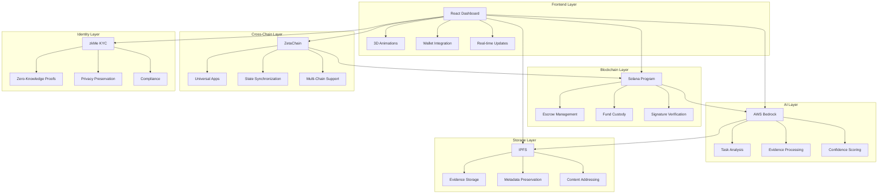

# 🌌 AetherLock Protocol - Complete Implementation Guide

> **Next-Generation Decentralized Escrow with AI-Powered Verification and Cross-Chain Compatibility**

[](https://opensource.org/licenses/MIT)
[](https://solana.com/)
[](https://zetachain.com/)
[](https://aws.amazon.com/bedrock/)

## 🚀 Project Overview

AetherLock Protocol is a revolutionary blockchain-based escrow system that combines:
- **Solana Smart Contracts** for high-performance escrow management
- **AI-Powered Verification** using AWS Bedrock for task completion analysis
- **Cross-Chain Compatibility** via ZetaChain Universal Apps
- **Zero-Knowledge KYC** through zkMe integration
- **Decentralized Storage** with IPFS for evidence preservation
- **Advanced Frontend** with 3D animations and cyberpunk aesthetics

## 📋 Table of Contents

- [🏗️ Architecture Overview](#️-architecture-overview)
- [🛠️ Technology Stack](#️-technology-stack)
- [⚡ Quick Start](#-quick-start)
- [📦 Installation Guide](#-installation-guide)
- [🔧 Configuration](#-configuration)
- [🎯 Usage Examples](#-usage-examples)
- [🧪 Testing](#-testing)
- [🚀 Deployment](#-deployment)
- [📚 API Documentation](#-api-documentation)
- [🔐 Security Features](#-security-features)
- [🌐 Cross-Chain Integration](#-cross-chain-integration)
- [🤖 AI Verification System](#-ai-verification-system)
- [📊 Demo & Showcase](#-demo--showcase)
- [🛣️ Roadmap](#️-roadmap)
- [🤝 Contributing](#-contributing)

## 🏗️ Architecture Overview



## 🛠️ Technology Stack

### Core Technologies
- **Blockchain**: Solana (Anchor Framework)
- **AI/ML**: AWS Bedrock (Claude 3 Sonnet)
- **Cross-Chain**: ZetaChain Universal Apps
- **Storage**: IPFS (Web3.Storage)
- **Identity**: zkMe Zero-Knowledge KYC

### Frontend Stack
- **Framework**: React 19.1.1 + TypeScript
- **3D Graphics**: Three.js + React Three Fiber
- **Animations**: Framer Motion + React Spring
- **Styling**: Tailwind CSS 4.1.14
- **State Management**: Zustand
- **Wallet Integration**: Solana Wallet Adapter

### Backend Stack
- **Runtime**: Node.js (ES Modules)
- **Framework**: Express.js
- **Cryptography**: Ed25519 (tweetnacl)
- **File Processing**: Multer + Sharp
- **Testing**: Jest + Supertest

### Development Tools
- **Build Tool**: Vite 7.1.7
- **Linting**: ESLint 9.36.0
- **Testing**: Anchor Test Suite
- **Package Manager**: npm

## ⚡ Quick Start

### Prerequisites
- Node.js 18+ and npm
- Rust and Cargo
- Solana CLI
- Anchor CLI
- AWS Account (for Bedrock)
- Web3.Storage Account

### 1-Minute Setup
```bash
# Clone the repository
git clone https://github.com/your-org/aetherlock-protocol.git
cd aetherlock-protocol

# Install all dependencies
npm run install:all

# Set up environment variables
cp .env.example .env
# Edit .env with your configuration

# Start development environment
npm run dev:all
```

### Access Points
- **Frontend Dashboard**: http://localhost:5173
- **Enhanced Dashboard**: http://localhost:5173/enhanced
- **Universal Dashboard**: http://localhost:5173/universal
- **Demo Showcase**: http://localhost:5173/demo
- **AI Agent API**: http://localhost:3001
- **Health Check**: http://localhost:3001/health

## 📦 Installation Guide

### Step 1: Environment Setup

```bash
# Install Solana CLI
sh -c "$(curl -sSfL https://release.solana.com/v1.18.0/install)"

# Install Anchor CLI
npm install -g @coral-xyz/anchor-cli

# Verify installations
solana --version
anchor --version
```

### Step 2: Project Installation

```bash
# Frontend dependencies
cd frontend
npm install

# Backend dependencies
cd ../backend
npm install

# Smart contract dependencies
cd ../solana-program
npm install
```

### Step 3: Build Smart Contracts

```bash
cd solana-program
anchor build
anchor deploy --provider.cluster devnet
```

## 🔧 Configuration

### Environment Variables

#### Frontend (.env)
```env
# Solana Configuration
VITE_SOLANA_NETWORK=devnet
VITE_SOLANA_RPC_URL=https://api.devnet.solana.com
VITE_PROGRAM_ID=AetherLockEscrow11111111111111111111111111

# ZetaChain Configuration
VITE_ZETACHAIN_NETWORK=testnet
VITE_ZETACHAIN_RPC_URL=https://zetachain-athens-evm.blockpi.network/v1/rpc/public
VITE_ZETACHAIN_CHAIN_ID=7001

# zkMe Configuration
VITE_ZKME_APP_ID=your_zkme_app_id
VITE_ZKME_API_KEY=your_zkme_api_key

# API Endpoints
VITE_AI_AGENT_URL=http://localhost:3001
VITE_BACKEND_URL=http://localhost:3001
```

#### Backend (.env)
```env
# Server Configuration
PORT=3001
NODE_ENV=development
CORS_ORIGIN=http://localhost:5173

# AWS Configuration
AWS_REGION=us-east-1
AWS_ACCESS_KEY_ID=your_aws_access_key
AWS_SECRET_ACCESS_KEY=your_aws_secret_key
AWS_BEDROCK_MODEL_ID=anthropic.claude-3-sonnet-20240229-v1:0

# IPFS Configuration
WEB3_STORAGE_TOKEN=your_web3_storage_token

# AI Configuration
VERIFICATION_CONFIDENCE_THRESHOLD=0.7
AI_AGENT_VERSION=1.0.0

# Security
SIGNATURE_ALGORITHM=Ed25519
KEY_STORAGE_PATH=./keys
```

### Smart Contract Configuration

```toml
# Anchor.toml
[features]
seeds = false
skip-lint = false

[programs.devnet]
aetherlock_escrow = "AetherLockEscrow11111111111111111111111111"

[registry]
url = "https://api.apr.dev"

[provider]
cluster = "devnet"
wallet = "~/.config/solana/id.json"

[scripts]
test = "yarn run ts-mocha -p ./tsconfig.json -t 1000000 tests/**/*.ts"
```

## 🎯 Usage Examples

### 1. Creating an Escrow

```typescript
import { AnchorProvider, Program } from '@coral-xyz/anchor'
import { AetherlockEscrow } from './types/aetherlock_escrow'

// Initialize program
const provider = AnchorProvider.env()
const program = new Program<AetherlockEscrow>(IDL, programId, provider)

// Create escrow
const escrowId = new Uint8Array(32)
crypto.getRandomValues(escrowId)

await program.methods
  .initializeEscrow(
    Array.from(escrowId),
    sellerPublicKey,
    new BN(1000000), // 1 SOL
    new BN(Math.floor(Date.now() / 1000) + 3600), // 1 hour expiry
    Array.from(metadataHash),
    aiAgentPublicKey
  )
  .accounts({
    buyer: buyerPublicKey,
    escrow: escrowPDA,
    tokenMint: tokenMint,
    systemProgram: SystemProgram.programId,
  })
  .signers([buyer])
  .rpc()
```

### 2. AI Verification Request

```javascript
// Upload evidence to IPFS
const formData = new FormData()
formData.append('escrow_id', escrowId)
formData.append('evidence', file)

const uploadResponse = await fetch('/api/evidence/upload', {
  method: 'POST',
  body: formData
})

// Request AI verification
const verificationResponse = await fetch('/api/verification/verify', {
  method: 'POST',
  headers: { 'Content-Type': 'application/json' },
  body: JSON.stringify({
    escrow_id: escrowId,
    task_description: 'Create a React component with user authentication',
    evidence: uploadResponse.data.files
  })
})

const { signature, verification } = verificationResponse.data
```

### 3. Cross-Chain Escrow Creation

```typescript
import { zetaChainService } from './services/zetachain'

// Create universal escrow
const universalEscrow = await zetaChainService.createUniversalEscrow({
  escrowId: 'universal_escrow_001',
  buyer: buyerAddress,
  seller: sellerAddress,
  amount: '1.5',
  originChain: 'solana',
  targetChains: ['sui', 'ton'],
  metadata: {
    taskDescription: 'Cross-chain smart contract development',
    expiry: Math.floor(Date.now() / 1000) + 86400,
    aiAgentPubkey: aiAgentKey
  }
})
```

### 4. zkMe KYC Integration

```typescript
import { zkMeWidget } from '@zkmelabs/widget'

// Initialize KYC verification
const kycResult = await zkMeWidget.verify({
  appId: process.env.VITE_ZKME_APP_ID,
  userAddress: walletAddress,
  chainId: 'solana-devnet'
})

// Store universal KYC proof
await zetaChainService.storeUniversalKYC({
  userAddress: walletAddress,
  kycProofHash: kycResult.proofHash,
  zkProofData: kycResult.zkProof,
  validChains: ['solana', 'sui', 'ton', 'zetachain']
})
```

## 🧪 Testing

### Smart Contract Tests

```bash
cd solana-program
anchor test
```

**Test Coverage:**
- ✅ Escrow state transitions (Created → Funded → Verified → Released)
- ✅ AI agent signature verification with Ed25519
- ✅ Fee calculation and distribution (2% protocol fee)
- ✅ Dispute resolution with admin authorization
- ✅ Timeout handling and automatic refunds
- ✅ Error conditions and edge cases

### AI Agent Tests

```bash
cd backend
npm test
```

**Test Coverage:**
- ✅ Evidence upload to IPFS
- ✅ AI verification with AWS Bedrock
- ✅ Signature generation and validation
- ✅ Error handling and edge cases
- ✅ Performance and concurrency tests
- ✅ Integration workflow tests

### Frontend Tests

```bash
cd frontend
npm test
```

**Test Coverage:**
- ✅ Wallet connection flows
- ✅ Escrow creation wizard
- ✅ Animation performance
- ✅ Responsive design
- ✅ Cross-browser compatibility

## 🚀 Deployment

### Devnet Deployment

```bash
# Deploy smart contracts
cd solana-program
anchor build
anchor deploy --provider.cluster devnet

# Deploy AI agent service
cd ../backend
npm run build
npm start

# Build and serve frontend
cd ../frontend
npm run build
npm run preview
```

### Production Deployment

#### AWS Lambda (AI Agent)
```bash
# Package for Lambda
npm run build:lambda
zip -r aetherlock-ai-agent.zip dist/ node_modules/

# Deploy using AWS CLI
aws lambda create-function \
  --function-name aetherlock-ai-agent \
  --runtime nodejs18.x \
  --zip-file fileb://aetherlock-ai-agent.zip \
  --handler dist/lambda.handler
```

#### Vercel (Frontend)
```bash
# Install Vercel CLI
npm i -g vercel

# Deploy to Vercel
cd frontend
vercel --prod
```

#### Solana Mainnet
```bash
# Switch to mainnet
solana config set --url mainnet-beta

# Deploy program
anchor deploy --provider.cluster mainnet-beta
```

## 📚 API Documentation

### AI Agent Endpoints

#### POST /api/verification/verify
Verify task completion using AI analysis.

**Request:**
```json
{
  "escrow_id": "string",
  "task_description": "string",
  "evidence": [
    {
      "filename": "string",
      "type": "string",
      "size": "number",
      "hash": "string",
      "ipfs_url": "string"
    }
  ]
}
```

**Response:**
```json
{
  "success": true,
  "data": {
    "verification": {
      "escrow_id": "string",
      "result": "boolean",
      "evidence_hash": "string",
      "confidence_score": "number",
      "timestamp": "number"
    },
    "signature": "string",
    "message": "string",
    "ai_analysis": {
      "explanation": "string",
      "model_used": "string"
    }
  }
}
```

#### POST /api/evidence/upload
Upload evidence files to IPFS.

**Request:** `multipart/form-data`
- `escrow_id`: string
- `evidence`: file(s)
- `description`: string (optional)

**Response:**
```json
{
  "success": true,
  "data": {
    "escrow_id": "string",
    "ipfs_cid": "string",
    "evidence_hash": "string",
    "files": [
      {
        "filename": "string",
        "size": "number",
        "type": "string",
        "hash": "string",
        "ipfs_url": "string"
      }
    ]
  }
}
```

#### GET /api/keys/public
Get AI agent public key for signature verification.

**Response:**
```json
{
  "success": true,
  "data": {
    "public_key": "string",
    "key_format": "base58",
    "algorithm": "Ed25519"
  }
}
```

### Smart Contract Instructions

#### initialize_escrow
Create a new escrow contract.

**Parameters:**
- `escrow_id`: [u8; 32] - Unique escrow identifier
- `seller`: Pubkey - Seller's wallet address
- `amount`: u64 - Escrow amount in lamports
- `expiry`: i64 - Unix timestamp for expiry
- `metadata_hash`: [u8; 32] - Task metadata hash
- `ai_agent_pubkey`: Pubkey - Authorized AI agent key

#### submit_verification
Submit AI verification result with signature.

**Parameters:**
- `result`: bool - Verification result
- `evidence_hash`: [u8; 32] - Evidence content hash
- `timestamp`: i64 - Verification timestamp
- `signature`: [u8; 64] - Ed25519 signature

#### release_funds
Release funds to seller after successful verification.

**Accounts:**
- `buyer`: Signer - Transaction initiator
- `escrow`: Account - Escrow state account
- `escrow_vault`: Account - Token vault
- `seller_token_account`: Account - Seller's token account
- `protocol_treasury`: Account - Protocol fee account

## 🔐 Security Features

### Cryptographic Security
- **Ed25519 Signatures**: All AI verifications cryptographically signed
- **Hash Verification**: Evidence integrity protected with SHA-256
- **Timestamp Validation**: Replay attack prevention (5-minute window)
- **Key Rotation**: Support for AI agent key updates

### Smart Contract Security
- **PDA Authorization**: Program Derived Addresses for secure account access
- **State Validation**: Comprehensive state transition checks
- **Overflow Protection**: Safe math operations with error handling
- **Admin Controls**: Multi-signature admin system for dispute resolution

### Privacy Protection
- **Zero-Knowledge KYC**: Identity verification without data exposure
- **IPFS Encryption**: Optional evidence encryption before storage
- **Metadata Hashing**: Sensitive data stored as hashes only

### Access Control
- **Role-Based Permissions**: Buyer, seller, admin, and AI agent roles
- **Time-Based Locks**: Automatic expiry and timeout mechanisms
- **Dispute Windows**: Limited time frames for dispute resolution

## 🌐 Cross-Chain Integration

### ZetaChain Universal Apps

AetherLock leverages ZetaChain's Universal App architecture to enable seamless cross-chain escrow functionality:

#### Supported Chains
- **Solana**: Primary escrow execution
- **Sui**: Move-based escrow modules
- **TON**: Smart contract integration
- **ZetaChain**: Universal state coordination

#### Cross-Chain Features
- **State Synchronization**: Real-time escrow state across all chains
- **Universal KYC**: Single KYC verification valid across all chains
- **Cross-Chain Events**: Event broadcasting and listening
- **Atomic Operations**: Coordinated multi-chain transactions

#### Implementation Example
```typescript
// Create cross-chain escrow
const universalEscrow = await zetaChainService.createUniversalEscrow({
  escrowId: 'cross_chain_001',
  originChain: 'solana',
  targetChains: ['sui', 'ton'],
  // ... other parameters
})

// Listen for cross-chain events
zetaChainService.subscribeToUniversalEvents((event) => {
  console.log('Cross-chain event:', event)
  // Handle state updates across all connected chains
})
```

## 🤖 AI Verification System

### AWS Bedrock Integration

The AI verification system uses AWS Bedrock's Claude 3 Sonnet model for intelligent task completion analysis:

#### Verification Process
1. **Evidence Collection**: Files uploaded to IPFS
2. **Content Analysis**: AI processes evidence against task requirements
3. **Confidence Scoring**: Deterministic scoring algorithm
4. **Signature Generation**: Ed25519 signature for blockchain verification

#### AI Analysis Features
- **Multi-Modal Processing**: Text, images, documents, and code
- **Task Complexity Assessment**: Automatic difficulty evaluation
- **Keyword Extraction**: Requirement matching and validation
- **Risk Assessment**: Fraud detection and quality analysis

#### Scoring Algorithm
```javascript
// Deterministic scoring factors
const scoringFactors = {
  evidenceQuantity: 20,    // Number and quality of files
  evidenceDiversity: 18,   // File type variety
  fileQuality: 12,         // Size and content analysis
  aiConfidence: 35,        // AI model confidence
  taskAlignment: 15        // Evidence-task matching
}

const finalScore = Math.min(
  Object.values(scoringFactors).reduce((sum, score) => sum + score, 0),
  100
)
```

## 📊 Demo & Showcase

### Interactive Demo Features

Access the demo at `/demo` to experience:

#### 3D Visualizations
- **Rotating AetherLock Logo**: Three.js animated logo with particle effects
- **Network Topology**: Interactive cross-chain connection visualization
- **Data Flow Animation**: Real-time transaction flow between chains

#### Auto-Play Demo Flow
1. **Wallet Connection**: Animated wallet selection and connection
2. **KYC Verification**: zkMe integration demonstration
3. **Escrow Creation**: Cross-chain escrow setup
4. **Evidence Upload**: IPFS file upload with progress tracking
5. **AI Verification**: Real-time AI analysis visualization
6. **Fund Release**: Animated fund distribution across chains

#### Live Statistics
- **Active Escrows**: Real-time counter with animations
- **Total Volume**: Animated volume tracking
- **Success Rate**: Dynamic success rate display
- **Network Status**: Live chain connectivity indicators

### Demo Controls
- **Play/Pause**: Control demo auto-progression
- **Step Navigation**: Click any step to jump to it
- **Reset**: Restart demo from beginning
- **Interactive Elements**: Hover and click for detailed information

## 🛣️ Roadmap

### Phase 1: Core Infrastructure ✅
- [x] Solana smart contract development
- [x] AI agent service with AWS Bedrock
- [x] IPFS evidence storage integration
- [x] Basic frontend with wallet integration

### Phase 2: Advanced Features ✅
- [x] zkMe KYC integration
- [x] Cross-chain ZetaChain integration
- [x] Enhanced UI with 3D animations
- [x] Comprehensive testing suite

### Phase 3: Production Ready 🚧
- [ ] Mainnet deployment
- [ ] Security audit completion
- [ ] Performance optimization
- [ ] Documentation finalization

### Phase 4: Ecosystem Expansion 🔮
- [ ] Additional chain integrations (Ethereum, Polygon)
- [ ] Mobile application development
- [ ] Enterprise API and SDK
- [ ] Governance token and DAO

### Future Enhancements
- [ ] Multi-language AI support
- [ ] Advanced dispute resolution mechanisms
- [ ] Integration with traditional payment systems
- [ ] Regulatory compliance modules

## 🤝 Contributing

We welcome contributions from the community! Here's how to get started:

### Development Setup
```bash
# Fork and clone the repository
git clone https://github.com/your-username/aetherlock-protocol.git
cd aetherlock-protocol

# Create a feature branch
git checkout -b feature/your-feature-name

# Install dependencies
npm run install:all

# Start development environment
npm run dev:all
```

### Contribution Guidelines
1. **Code Style**: Follow existing patterns and use provided linting rules
2. **Testing**: Add tests for new features and ensure all tests pass
3. **Documentation**: Update documentation for any API changes
4. **Commit Messages**: Use conventional commit format
5. **Pull Requests**: Provide clear description and link related issues

### Areas for Contribution
- **Smart Contract Optimizations**: Gas efficiency improvements
- **AI Model Enhancements**: Better verification algorithms
- **UI/UX Improvements**: Enhanced user experience
- **Cross-Chain Integrations**: Additional blockchain support
- **Security Audits**: Code review and vulnerability assessment

### Community
- **Discord**: [Join our community](https://discord.gg/aetherlock)
- **Twitter**: [@AetherLockProtocol](https://twitter.com/aetherlockprotocol)
- **GitHub Discussions**: [Technical discussions](https://github.com/aetherlock/protocol/discussions)

## 📄 License

This project is licensed under the MIT License - see the [LICENSE](LICENSE) file for details.

## 🙏 Acknowledgments

- **Solana Foundation** for blockchain infrastructure
- **AWS** for AI/ML services
- **ZetaChain** for cross-chain capabilities
- **zkMe** for privacy-preserving KYC
- **IPFS** for decentralized storage
- **Open Source Community** for tools and libraries

---

**Built with ❤️ by the AetherLock Team**

*Revolutionizing decentralized escrow with AI-powered verification and cross-chain compatibility.*