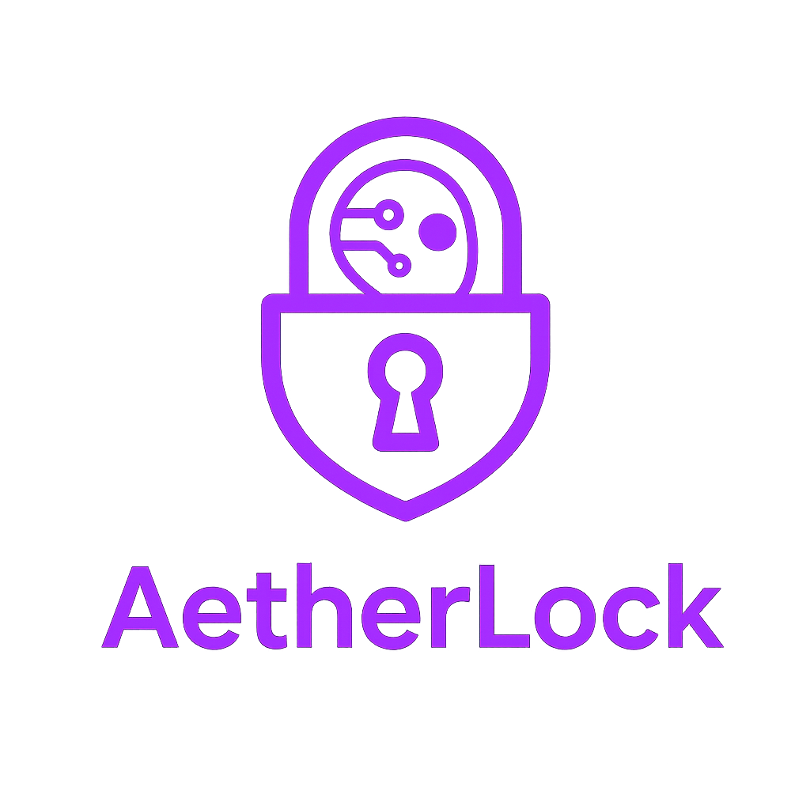

# 🧠 AetherLock Protocol

> **AI-driven, trustless, and agentic escrow & verification protocol**  
> Combining **Blockchain**, **AI Agents**, and **Zero-Knowledge Identity** to power the next evolution of secure P2P transactions.

 <!-- Your uploaded neon purple lock icon on black background with "AetherLock" text -->

---

## 🌌 Overview

**AetherLock** is a next-generation AI-driven escrow protocol built on Solana, designed to revolutionize trustless transactions through intelligent automation and zero-knowledge privacy.

AetherLock is a multi-layer protocol that enables autonomous escrow and task verification across Web3 ecosystems. It integrates Solana smart contracts, ZetaChain's cross-chain verification, and zkMe's zero-knowledge KYC with AI-powered agents that act as unbiased digital mediators.

AetherLock provides the missing link between trust, automation, and privacy — allowing users to transact, verify, and resolve disputes without intermediaries.

---

## 🚀 Core Features

| Feature | Description |
|----------|--------------|
| **Agentic Escrow** | AI-powered escrow that releases funds based on verified task completion |
| **Zero-Knowledge KYC** | zkMe integration ensures compliance without exposing user data |
| **AI Verification Agents** | Off-chain models analyze submitted evidence and sign results cryptographically |
| **Dispute Resolution** | Built-in time-bound dispute process with admin fallback |
| **Cross-chain Proof Validation** | Uses ZetaChain to validate zk proofs across multiple chains |
| **Decentralized Evidence Storage** | IPFS for transparent, immutable, and privacy-preserving evidence logs |

**Key Features (from Docs)**:
* AI-Powered Verification: AWS Bedrock Claude integration for intelligent task validation
* Zero-Knowledge KYC: Privacy-preserving identity verification via zkMe on ZetaChain
* Multi-Chain Architecture: Solana MVP with planned expansion to other chains
* IPFS Evidence Storage: Decentralized storage for dispute resolution materials
* Cyberpunk Dashboard: Immersive React interface with Framer Motion animations

---

## 🏗️ Architecture

AetherLock is a multi-chain escrow protocol that combines Solana's fast transaction processing with Zeta Chain's zero-knowledge capabilities and AI-powered verification. The system creates a trustless environment where AI agents act as objective arbiters for task completion verification.

### Architecture Diagram (From Mintlify Docs)

```mermaid
graph TB
    subgraph "Frontend Layer"
        UI[Universal Escrow Dashboard]
        WC[Multi-Chain Wallet Connect]
    end
    
    subgraph "ZetaChain Universal Layer"
        ZG[ZetaChain Gateway]
        UA[Universal App Contract]
        ZKY[zkKYC Universal Storage]
    end
    
    subgraph "Multi-Chain Ecosystem"
        SC[Solana Escrow Contract]
        SUI[Sui Escrow Module]
        TON[TON Escrow Contract]
    end
    
    subgraph "AI & Oracle Layer"
        AI[AI Agent Service]
        OR[Cross-Chain Oracle]
    end
    
    subgraph "Storage Layer"
        IPFS[IPFS Evidence Storage]
        BE[Node.js Backend]
    end
    
    UI --> WC
    WC --> ZG
    ZG --> UA
    UA --> SC
    UA --> SUI
    UA --> TON
    ZG --> ZKY
    AI --> IPFS
    AI --> OR
    OR --> ZG
    BE --> AI
    BE --> ZG
    
    classDef zetachain fill:#00d4aa,stroke:#00b894,color:#fff
    classDef blockchain fill:#9333ea,stroke:#7c3aed,color:#fff
    classDef ai fill:#06b6d4,stroke:#0891b2,color:#fff
    classDef storage fill:#10b981,stroke:#059669,color:#fff
    classDef frontend fill:#f59e0b,stroke:#d97706,color:#fff
    
    class ZG,UA,ZKY zetachain
    class SC,SUI,TON blockchain
    class AI,OR ai
    class IPFS,BE storage
    class UI,WC frontend
