# AetherLock: Omnichain Escrow with AI-Powered Risk Verification

## 1. Project Overview

AetherLock is a cross-chain escrow protocol enabling parties to exchange assets across Solana, Sui, TON, and Somnia with AI-powered Proof of Task verification (PoTv) ( and zkMe-based identity verification. Built on ZetaChain's Universal App framework, AetherLock serves as the omnichain orchestration layer, routing messages and assets between blockchain networks while leveraging off-chain AI to assess counterparty risk and Chainlink Functions for deterministic verification.

The protocol is designed to be launched as a startup and was brought to build by ‘‘AMAZON TOOls(Q and KIRO IDE)’’ for hackathon judges to verify: seamless multi-chain integration, real identity verification via zkMe KYC, AI-driven risk assessment with cryptographic proof, and cross-chain message finality without custodial risk.

---

## 2. Quick Start

### Prerequisites
- **Node.js** 18+
- **Rust** 1.70+
- **Anchor CLI** (`avm install latest`)
- **Solana CLI** (configure with devnet: `solana config set --url https://api.devnet.solana.com`)
- **Foundry** (for Solidity contracts)
- **Git** & **Docker** (optional, for local IPFS)

### Clone & Install

```bash
git clone https://github.com/aetherlock/aetherlock.git
cd aetherlock
npm install
```

### Build Solana Program

```bash
cd solana/programs/aetherlock
anchor build
```

### Build & Deploy ZetaChain Contract

```bash
cd zeta-contracts
npm install
npx hardhat compile
npx hardhat deploy --network zetachain-testnet
```

### Run Backend

```bash
cd backend
cp .env.example .env
# Edit .env with your keys and placeholders (see Section 14)
npm run dev
```

### Run Frontend

```bash
cd frontend
cp .env.local.example .env.local
# Edit .env.local with API URLs and RPC endpoints
npm run dev
```

**Verify locally:** navigate to `http://localhost:3000`, connect wallet (Phantom/MetaMask), and test escrow creation flow.

---

## 3. Architecture Diagram

```mermaid
graph TB
    subgraph Frontend["Frontend Layer (Next.js/React)"]
        Dashboard["📊 Escrow Dashboard"]
        KycWidget["🔐 KYC Widget<br/>(zkMe)"]
        VerificationUI["⚠️ AI Risk<br/>Verification UI"]
        Notifications["🔔 WebSocket<br/>Notifications"]
    end

    subgraph Backend["Backend Services (Express/Node.js)"]
        EscrowService["📋 Escrow Service"]
        AIService["🤖 AI Verification<br/>Service"]
        StorageService["💾 IPFS/Pinata<br/>Service"]
        AuthService["🔑 Auth & Rate<br/>Limiting"]
    end

    subgraph OracleServices["Oracle & Identity Services"]
        Chainlink["⛓️ Chainlink Functions<br/>Router & DON"]
        zkMe["🆔 zkMe KYC<br/>API"]
        IPFS["🌐 IPFS/Pinata<br/>Web3.Storage"]
    end

    subgraph MessageRouter["Multi-Chain Message Router"]
        XCall["🔄 ZetaChain xCall<br/>Gateway"]
    end

    subgraph Blockchains["Blockchain Layer"]
        SolanaProgram["⚓ Solana Program<br/>(Anchor)<br/>- new_escrow<br/>- verify_escrow<br/>- release_escrow"]
        ZetaContract["⚙️ ZetaChain Contract<br/>(Solidity)<br/>- onCall<br/>- onRevert<br/>- onAbort"]
        SomniaContract["📍 Somnia Settlement<br/>(Solidity)<br/>- handleSettlement<br/>- releaseSettlement"]
        TONContract["📱 TON Smart<br/>Contract<br/>(FunC)"]
    end

    subgraph AILayer["AI Verification Layer"]
        Arcanum["🧠 Arcanum.ai<br/>(Primary)"]
        OpenAI["🤖 OpenAI GPT-4<br/>(Fallback 1)"]
        Claude["💭 Anthropic Claude<br/>(Fallback 2)"]
        EdVerify["✍️ Ed25519 Signing<br/>(Proof)"]
    end

    %% Frontend to Backend
    Dashboard -->|REST API| EscrowService
    KycWidget -->|Embed & Callback| AuthService
    VerificationUI -->|Poll Status| AIService
    Notifications -->|WebSocket| Backend

    %% Backend to Services
    EscrowService -->|Create/Update| StorageService
    AIService -->|Fetch Evidence| StorageService
    AuthService -->|Rate Limit| EscrowService
    EscrowService -->|Trigger Chainlink| Chainlink

    %% Backend to Oracle Services
    AIService -->|Call API| Arcanum
    Arcanum -->|Risk Score| AIService
    zkMe -->|Webhook| AuthService
    StorageService -->|Pin/Fetch| IPFS

    %% Backend to Message Router
    EscrowService -->|Send Message| XCall

    %% Message Router to Blockchains
    XCall -->|xCall| SolanaProgram
    XCall -->|xCall| ZetaContract
    XCall -->|xCall| SomniaContract
    XCall -->|xCall| TONContract

    %% Blockchain Cross-Chain
    SolanaProgram -->|Emit Event| ZetaContract
    ZetaContract -->|onCall| SumniaContract
    ZetaContract -->|onRevert| SolanaProgram
    SumniaContract -->|Callback| ZetaContract

    %% AI Layer
    AIService -->|Evidence| Arcanum
    AIService -->|Fallback| OpenAI
    OpenAI -->|Fallback| Claude
    AIService -->|Sign Result| EdVerify

    %% Chainlink
    Chainlink -->|Off-Chain Compute| AILayer
    Chainlink -->|Return Result| ZetaContract

    style Frontend fill:#e1f5ff
    style Backend fill:#f3e5f5
    style OracleServices fill:#fff3e0
    style MessageRouter fill:#fce4ec
    style Blockchains fill:#e8f5e9
    style AILayer fill:#f1f8e9
```



---

## 4. Components & Responsibilities

| Component | Language | Role |
|-----------|----------|------|
| **Solana Program** | Rust/Anchor | Manages escrow state, holds collateral, verifies cross-chain messages from ZetaChain |
| **ZetaChain Universal App** | Solidity | Omnichain gateway; orchestrates messages between Solana and target chains; handles xCall, onCall, onRevert, onAbort |
| **Somnia Contract** | Solidity | Target-chain escrow handler; executes final settlement on Somnia testnet |
| **TON Contract** | FunC (optional) | Alternative target chain for cross-chain settlement |
| **Backend Services** | Node.js/Express | REST API for escrow CRUD, zkMe KYC webhook, Chainlink Functions triggering, AI verification, IPFS pinning, notifications |
| **Frontend** | React/Next.js | Wallet connection, escrow creation UI, KYC widget integration, AI risk verification dashboard, notifications |
| **Chainlink Functions** | JavaScript | Off-chain computation: fetches price feeds, validates escrow conditions, returns verified result to smart contract |
| **zkMe KYC** | API | Identity verification; backend receives webhook with KYC result; frontend embeds widget |
| **AI Verification** | Python/TypeScript | Analyzes evidence (documents, transaction history), returns risk score + confidence; results signed with Ed25519 |
| **IPFS / Pinata / Web3.Storage** | Distributed | Evidence storage; signatures stored on IPFS; referenced in escrow record via content hash |

---

## 5. ZetaChain (Universal App)

### Role of ZetaChain

ZetaChain is the **omnichain orchestration layer**, not the primary ledger. AetherLock uses ZetaChain's Universal App framework to:

1. **Accept xCall messages** from Solana (via Solana Program → ZetaChain Gateway).
2. **Route escrow logic** to target chains (Sui, TON, Somnia).
3. **Handle onCall, onRevert, onAbort** lifecycle events.
4. **Emit finality proof** back to Solana for state reconciliation.

### Integration Flow: Solana → ZetaChain → Target Chain

```
1. User calls Solana Program: new_escrow(amount, counterparty_addr, target_chain, settlement_addr)
   ↓
2. Solana Program emits xCall message to ZetaChain Gateway
   (via Wormhole or native ZetaChain integration)
   ↓
3. ZetaChain Universal App receives onCall(sender, data)
   ↓
4. AetherLockUniversal.sol routes message to target chain:
   - If target == SOMNIA: call xCall(Somnia, settlement_payload)
   - If target == TON: call xCall(TON, settlement_payload)
   ↓
5. Target-chain contract executes settlement logic (lock collateral, await verification)
   ↓
6. Upon verification success, target chain emits onAbort(success=true) or
   direct callback via xCall to Solana Program
   ↓
7. Solana Program updates escrow state: VERIFIED → RELEASED / DISPUTED


### Deployment & Gateway Address

**ZetaChain Testnet Gateway Address** (placeholder; replace with actual):
```
ZETACHAIN_GATEWAY_ADDRESS=0x9E42bAc5c9d71c26900a9c35eb876d8d5f1166a0
```

**Retrieve actual gateway address:**
```bash
# Query ZetaChain testnet explorer or use:
curl https://api.athens3.zetachain.com/rpc \
  -X POST \
  -H "Content-Type: application/json" \
  -d '{"jsonrpc":"2.0","method":"eth_call","params":[{"to":"0x...","data":"0x..."}],"id":1}'
```

**Deploy to ZetaChain Testnet:**
```bash
cd zeta-contracts
npx hardhat deploy --network zetachain-testnet
# Note the deployed contract address
```

---

## 6. Somnia Integration

### Why Somnia?

Somnia testnet offers:
- **Fast finality** (sub-second)
- **High throughput** (thousands of TPS)
- **EVM-compatible** (Solidity contracts)
- **Bounty opportunities** for hackathon participants

### Somnia Testnet Details

| Parameter | Value |
|-----------|-------|
| **Chain ID** | `485` (or check current) |
| **RPC Endpoint** | `https://somnia-testnet-rpc.example.com` |
| **Block Explorer** | `https://somnia-testnet-explorer.example.com` |
| **Native Token** | `SMN` (test tokens available from faucet) |
| **Faucet** | `https://somnia-testnet-faucet.example.com` |

### Deploy Contract to Somnia

1. **Obtain test tokens:**
   ```bash
   # Visit faucet or use CLI
   curl https://somnia-testnet-faucet.example.com/drip \
     -X POST \
     -H "Content-Type: application/json" \
     -d '{"address":"0xYourAddressHere"}'
   ```

2. **Create Somnia deployment config** (`contracts/networks.js`):
   ```javascript
   module.exports = {
     somnia_testnet: {
       url: process.env.SOMNIA_RPC_URL || 'https://somnia-testnet-rpc.example.com',
       accounts: [process.env.PRIVATE_KEY],
       chainId: 485,
     }
   };
   ```

3. **Add to Hardhat config** (`hardhat.config.js`):
   ```javascript
   require('@nomicfoundation/hardhat-toolbox');
   
   module.exports = {
     solidity: '0.8.20',
     networks: {
       somnia_testnet: {
         url: process.env.SOMNIA_RPC_URL,
         accounts: [process.env.PRIVATE_KEY],
         chainId: 485,
       }
     }
   };
   ```

4. **Deploy settlement contract:**
   ```bash
   export SOMNIA_RPC_URL=https://somnia-testnet-rpc.example.com
   export PRIVATE_KEY=0xYourPrivateKeyHere
   npx hardhat run scripts/deploy-somnia.js --network somnia_testnet
   ```

5. **Integration with ZetaChain:**
   - Record the deployed contract address.
   - Update AetherLockUniversal.sol `_routeToTargetChain()` to recognize Somnia's chain ID.
   - Call xCall with Somnia settlement contract as target.

### 

### Submitting for Somnia Bounty

1. Deploy contract to Somnia testnet.
2. Record contract address and transaction hash.
3. Include demo link showing cross-chain escrow (Solana → ZetaChain → Somnia).
4. Submit via Somnia bounty portal with GitHub repo link.

---

## 7. Solana Program

### Anchor Program Structure

**File: `programs/aetherlock/src/lib.rs`**
